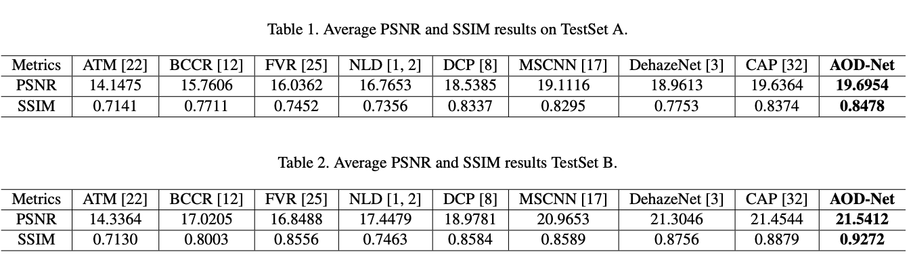

# AOD-Net

ICCV 2017 

AOD-Net is a light-weight but effective end-to-end dehazing neural network.


It is very easy and fast for you to train or test.

For test:

We have offered test.py, relevant prototxt and data.
You can just use 'python test.py' with GPU/CPU, you can obtain your result in data/result.

Good luck for your research.

# Improved AOD-Net with Positional Normalization (PONO)
We appreciate the [PyTorch implementation](https://github.com/TheFairBear/PyTorch-Image-Dehazing) of AOD-Net. Based on this code, we add simple [PONO](https://github.com/Boyiliee/PONO) into AOD-Net, which improves the performance efficiently.

Previous AOD-Net Results:


For TestSet A, the PSNR increases from 19.69 to 20.38 dB, the SSIM increases from 0.8478 to 0.8587. For TestSetB, the PSNR increases from 21.54 to 21.67 dB, the SSIM increases from 0.9272 to 0.9285.

Please find in [AOD-Net with PONO](https://github.com/Boyiliee/AOD-Net/tree/master/AOD-Net%20with%20PONO) for details.

Bibtex:
```
@inproceedings{ICCV17a,
  title={AOD-Net: All-in-One Dehazing Network},
  author={Li, Boyi and Peng, Xiulian and Wang, Zhangyang and Xu, Ji-Zheng and Feng, Dan},
  booktitle={Proceedings of the IEEE International Conference on Computer Vision},
  year={2017}
}

@article{pono,
  title={Positional Normalization},
  author={Li, Boyi and Wu, Felix and Weinberger, Kilian Q. and Belongie, Serge},
  journal={Advances in Neural Information Processing Systems},
  year={2019}
}
```
